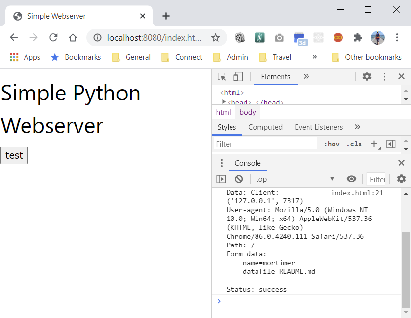

# Basic Webserver

I lot of this was taken from this:  

[Pymotw](https://pymotw.com/3/http.server/)

## Usage

`python .\webserver.py`

Open your browser and go to `http://localhost:8080/index.html`.   
Click on the test button and view the console.  


## Post

Manually posting to the root end point:  

```sh
curl -v http://localhost:8080/ -F name=mortimer -F foo=bar -F datafile=README.md
```

```log
*   Trying 127.0.0.1:8080...
* TCP_NODELAY set
* Connected to localhost (127.0.0.1) port 8080 (#0)
> POST / HTTP/1.1
> Host: localhost:8080
> User-Agent: curl/7.68.0
> Accept: */*
> Content-Length: 348
> Content-Type: multipart/form-data; boundary=------------------------6fa5fd5217819e59
>
* We are completely uploaded and fine
* Mark bundle as not supporting multiuse
* HTTP 1.0, assume close after body
< HTTP/1.0 200 OK
< Server: BaseHTTP/0.6 Python/3.9.0
< Date: Tue, 27 Oct 2020 23:11:39 GMT
< Content-Type: text/plain; charset=utf-8
<
Client: ('127.0.0.1', 7781)
User-agent: curl/7.68.0
Path: /
Form data:
        foo=bar
        name=mortimer
        datafile=README.md
* Closing connection 0
```